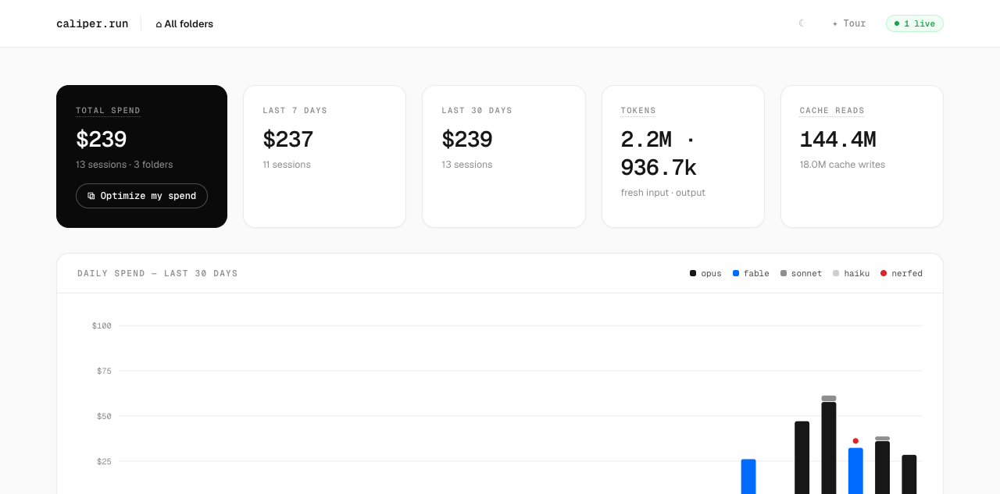
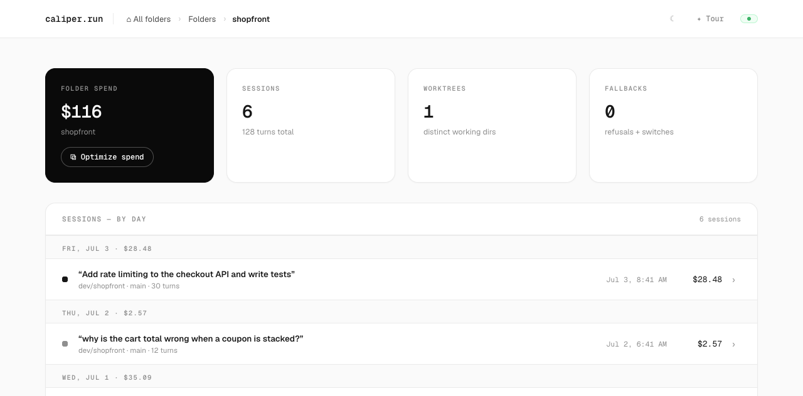
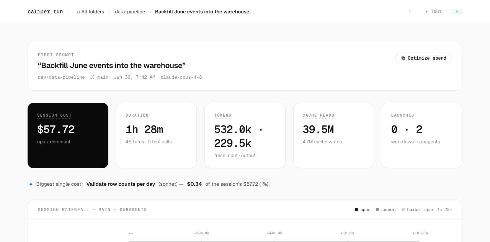

# Caliper

**Precision for your AI spend.** See where every Claude Code dollar goes — down to the individual tool call — then feed it back to Claude to spend less. → [caliper.run](https://caliper.run)



## Open source. Local. Yours.

- **100% local.** Reads the transcripts Claude Code already writes to `~/.claude/projects`. Nothing leaves your machine — no telemetry, no account, no cloud.
- **Open source, MIT.** Every number is auditable: cache-aware estimates at real per-model rates, parity-tested against [ccusage](https://github.com/ryoppippi/ccusage), formula shown in the UI.
- **You're in control.** Machine-wide totals down to the exact call that spent the money — and the tools to make the next session cheaper.

## Install

```sh
/plugin marketplace add Cost-Caliper/caliper
/plugin install caliper@caliper
```

- **`/caliper`** — launch the dashboard, pointed at your current session
- **`/optimize-spend`** — Claude reads your spend and, with consent, writes you a personalized cost-discipline skill

<details>
<summary>Upgrading from <code>workflow-lens</code> (pre-0.24)? Renamed — once per machine:</summary>

```sh
/plugin marketplace remove workflow-lens
/plugin marketplace add Cost-Caliper/caliper
/plugin install caliper@caliper
```
</details>

## What you get

| Sessions by folder & day | Session drill-down |
|---|---|
|  |  |

- **Machine-wide analytics** — all-time spend, daily charts stacked by model, every folder ranked (with filter + sorts), cache economics.
- **Session forensics** — waterfall of the main chat + every subagent on the real time axis, subagents ranked by cost, and per-run workflow timelines split into inference vs tool time.
- **"Nerfed by Fable" tracking** — counts every time Fable 5's safety classifier declined a request or Claude Code re-served it on the fallback model, split main chat vs subagents, with red markers on the daily chart and one-click prompts to analyze the reasons or disable auto-fallback. (Per-step prompt drill-down: `/legacy/` for now.)
- **The loop** — scope-aware **⧉ Optimize spend** buttons (machine / folder / session) copy your real numbers and live API pointers into a prompt; Claude analyzes the spend or writes you a cost skill.
- **Guided tour & dark mode** — ✦ Tour explains every panel on your own data; ☾ toggles a full dark theme.
- **Self-updating** — checks this repo and offers one-click updates. (Previous UI preserved at `/legacy/` for one release.)

*Screenshots are bundled demo data (`node scripts/demo-data.mjs`). Your dashboard shows your own transcripts, locally.*

## How costs are computed

```
cost = input×in + cache_write_5m×in×1.25 + cache_write_1h×in×2.0 + cache_read×in×0.10 + output×out
```

Per-model rates (fable-5 $10/$50 · opus $5/$25 · sonnet $3/$15 · haiku $1/$5 per Mtok), streamed duplicates deduplicated by request. **Estimates, not invoices** — the UI says so wherever a dollar appears.

## Repo layout

| Path | What it is |
|------|------------|
| `packages/control-tower/` | The dashboard: local web app + JSON API reconstructing sessions, workflows, and subagents from transcripts. |
| `packages/workflow-lens/` | Workflow-file toolkit: parse, lint, instrument, replay, estimate (keyless CLI + library). |
| `commands/`, `skills/` | `/caliper` (+ `/control-tower` alias), the `caliper` skill, `/optimize-spend`. |
| `scripts/` | Session-aware launcher, demo-data generator. |

Run from source:

```sh
node scripts/demo-data.mjs
WFLENS_PROJECTS_ROOT=/tmp/caliper-demo/projects PORT=8912 node packages/control-tower/server.mjs
```

Tests: `npm test` in each package — keyless fixtures, zero API calls.

First Caliper tool. Next: smart routing to open models, then models fine-tuned on your own usage — [caliper.run](https://caliper.run).

## License

MIT
